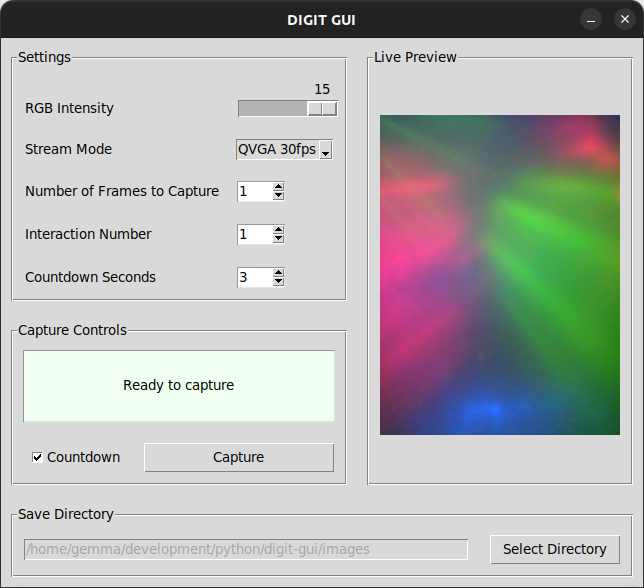

# DIGIT-GUI

## Overview

**DIGIT-GUI** is a user-friendly graphical interface for configuring and capturing data from a single [DIGIT](https://digit.ml/) tactile sensor. Built with **Tkinter**, it provides an accessible way to:

- Adjust sensor RGB LED intensity and video stream mode.
- Preview live tactile images in real time.
- Select the number of frames and interaction number for organised data collection.
- Choose and manage the save directory for captured images.
- Set a countdown timer before capturing starts.
- Capture and save single frames or batches of frames with a single click.
- Automatically save and restore user preferences.



## Requirements

- **Operating System:** Linux only (DIGIT sensors are supported on Linux only)  
- **Tested Environment:** Ubuntu 22.04, Python 3.10.12 
- **Python Environment:** Use a regular Python virtual environment (Tkinter and Anaconda have compatibility issues on Linux)
- **Packages:** [digit-interface](https://github.com/facebookresearch/digit-interface), [pillow](https://pypi.org/project/pillow/)

## Installation

1. **Clone the repository:**
   ```bash
   git clone https://github.com/gemixin/digit-gui.git
   cd digit-gui

2. **(Optional) Set up a virtual environment:** 
    ```bash
    python3 -m venv venv
    source venv/bin/activate

3. **Install the required packages:**  
    Tkinter is included with Python by default. Install the DIGIT interface library and Pillow:
    ```bash
    pip install -r requirements.txt

## Running the GUI

1. Connect your DIGIT sensor via USB.

2. Run the GUI script:
    ```bash
    python3 digit_gui.py

Notes for usage:
- Changes you make to settings will automatically be saved.
- The default save directory is the local directory.
- The maximum number of frames to capture at once is 600 (10 seconds at 60fps) (can be changed in the code if you wish).
- The maximum interaction number is 9999.
- The interaction number automatically increments after each capture, but can always be manually set as well.
- The maximum number of seconds for the countdown timer is 10 (can be changed in the code if you wish).

## Known Issues
- **VGA Mode Bug**:
The [digit-interface](https://github.com/facebookresearch/digit-interface) library has a known issue with VGA mode producing glitchy output.  
  See [issue #10](https://github.com/facebookresearch/digit-interface/issues/10).  
  ✅ **Recommendation:** Stick to **QVGA mode** for reliable operation.

## Citation

If you use DIGIT or this repo in your research, please cite:

**DIGIT: A Novel Design for a Low-Cost Compact High-Resolution Tactile Sensor with Application to In-Hand Manipulation**  
Mike Lambeta, Po-Wei Chou, Stephen Tian, Brian Yang, Benjamin Maloon, Victoria Rose Most, Dave Stroud, Raymond Santos, Ahmad Byagowi, Gregg Kammerer, Dinesh Jayaraman, Roberto Calandra  
_IEEE Robotics and Automation Letters (RA-L), vol. 5, no. 3, pp. 3838–3845, 2020_  
[https://doi.org/10.1109/LRA.2020.2977257](https://doi.org/10.1109/LRA.2020.2977257)